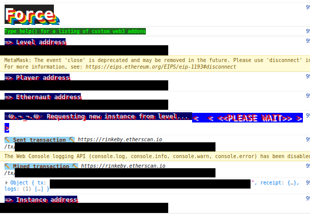
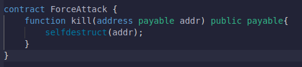
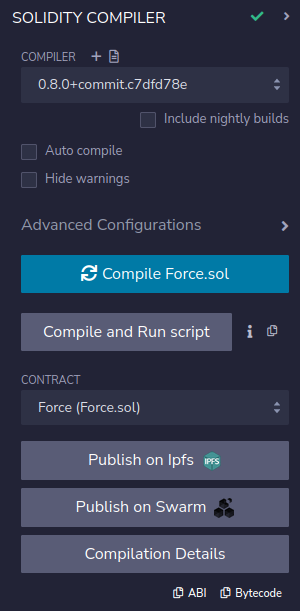
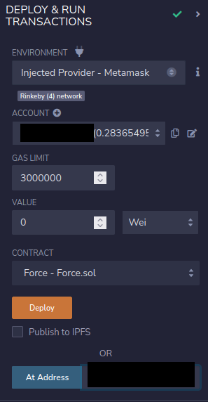
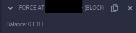
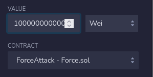
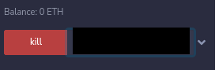
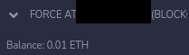

# 07: Force

The Ethernaut is a Web3/Solidity based wargame inspired by overthewire.org, played in the Ethereum Virtual Machine, in which each level is based on a smart contract that needs to be "hacked".

This is a sample walkthrough for the level called "Force".

## Setup

First off we need a wallet. Get the Metamask Wallet from https://metamask.io/ and choose whichever network works for you ( in my case i will be using Rinkeby's testnet).
Fund the wallet with Chainlink's faucet https://faucets.chain.link/rinkeby and then click on the button "Get new instance" to deploy the contract.

## Steps for completing the level
Click on F12 to get on Developer Tools. You will get something like this:

Go on Remix: https://remix.ethereum.org/ and make this change in Force.sol. 

Copy the Force.sol contract found before "submit instance" and "get new instance" buttons.

At Force.sol i made this next change:
>- <value> 1. Pragma version from **0.6.0** to **0.8.0**

This level asks us to send some eth amount in the Force contract, a contract that it's literally empty. Taking in account there's no fallback function inside the Force contract, our single option would be to use the selfdestruct function inside a new contract that we gonna call ForceAttack, which is gonna destroy itself and then send the left eth to the mentioned address.

At the ForceAttack contract add the kill function:
>- <value> function kill(address payable addr) public payable{
>- <value> selfdestruct(addr);}

It should look something like this:

Compile the contract:

 Instead of deploying Force.sol we are going to interact with the already deployed contract by using instance address showed on Developer Tools and we will be deploying ourselves the ForceAttack contract to the Rinkeby's Testnet. Also, dont forget to add your wallet on Environment by selecting "Injected Provider - Metamask".

Look at Force contract balance and you can see that the balance is empty:

Put some wei (0.01 eth is 1e16 wei ) to send as value before we activate the kill function:

Use the kill function to destroy the ForceAttack contract and send the eth to the Force Contract by using the instance's address as an input  :

Try again the balance of the Force contract:

Wow, congrats!! Now you have managed to forcefully send eth to the Force contract, but also you have completed this level.

Now finish the level by using the submit button at the bottom of the page.

Congrats! See you on to the next level.:wave: